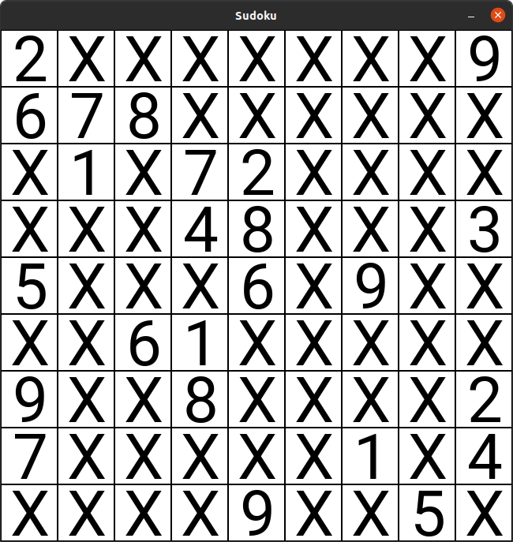
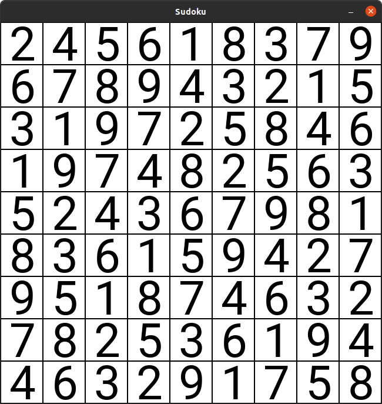

# Sudoku

This is a sudoku solver written in Python. (MIT License)

The solver uses a heuristic based backtracking algortithm. At any point in time, the solver considers the unfilled cell with the fewest number of legal candidate values. This heuristic allows for a large speedup in practice over an unguided backtracking approach.  

## Example Solve (New York Times, Hard)

## Example usage

Puzzles should be stored as a text file and given as an argument to main.py.

`python main.py path/to/file.txt`

Press "p" to run the solver and "q" to quit the program.

## puzzle file format

Space seperated text file, with X as a placeholder.
Each row of the puzzle should be on a newline.

Example from above: 

2 X X X X X X X 9 

6 7 8 X X X X X X 

X 1 X 7 2 X X X X 

X X X 4 8 X X X 3 

5 X X X 6 X 9 X X 

X X 6 1 X X X X X 

9 X X 8 X X X X 2 

7 X X X X X 1 X 4 

X X X X 9 X X 5 X

## Requirements

pygame==2.0.1

numpy==1.19.1
